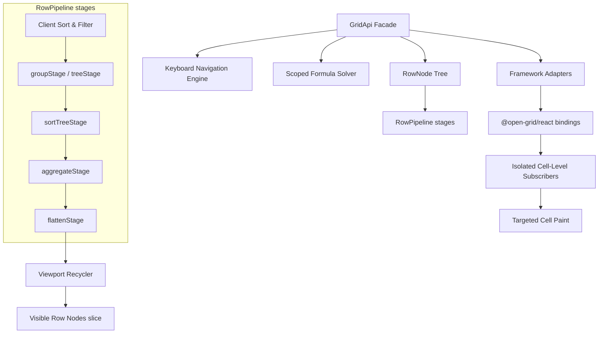

# 🚀 Headless High-Performance Data Grid & Spreadsheet Engine

Open Grid is a lightweight, framework-agnostic, headless grid engine for high-performance virtualized spreadsheets and data grids. Built to handle massive datasets with complex layouts, Open Grid maintains an out-of-render state loop in a centralized engine while exposing granular micro-subscriptions. This allows React, Vue, or vanilla JS wrappers to paint individual cells and rows with surgical precision, entirely bypassing the framework rendering bottleneck.

---

## ⚡ Technical Architecture Overview

To bypass virtual DOM performance bottlenecks and eliminate layout thrashing during rapid scrolling, Open Grid decouples raw record arrays from visual presentation using a dynamic **Row Node Tree** and a discriminated union **VisualRow** pipeline:



### Core Architecture Highlights

1. **Stateful RowNode Tree**: Separates raw data records from layout metadata (such as coordinate mappings, dynamic vertical offsets, selection flags, and expansion states).
2. **Discriminated VisualRow Model**: Rather than treating every row strictly as a data-centric `RowNode`, the layout engine outputs a flat, virtualized array of `VisualRow` nodes representing either data rows (`kind: 'data'`), grouping labels (`kind: 'group'`), or nested components (`kind: 'detail'`).
3. **Cellular Value Cache**: Prevents redundant `valueGetter` executions and runtime path-splitting operations by caching computed cell values directly on individual `RowNode` structures until data is modified.
4. **Pre-Compiled Path Getters**: Accessors (such as `user.profile.name`) are compiled into optimized, static functional selectors upon schema registration to avoid continuous garbage collection pressure.
5. **Targeted Micro-Subscriptions**: Cell components subscribe strictly to their coordinates (e.g., `cell:value:row-101:price`). Edits only repaint the exact target cell, formula dependents, and conditional formatting listeners.
6. **Active Viewport Subscription Garbage Collection**: Micro-subscriptions are bound dynamically. Scrolling cells out of the recycled DOM unmounts them, dereferencing their subscriptions to prevent memory leaks in long-running processes.

---

## 🔥 Key Developer Features

Open Grid comes equipped with an extensive suite of built-in features designed for advanced spreadsheet and data dashboard development:

- **High-Performance Virtualization**: Virtualizes both rows and columns dynamically, yielding standard 60 FPS performance even for massive datasets with 100,000+ rows and 1,000+ columns.
- **Sticky Lanes (Pinning)**: Floating stickiness for left/right columns and top/bottom rows with floating headers and scroll boundaries.
- **Excel-like Selections & Drag-to-Fill**: Features interactive multi-range cell selection, arrow keyboard navigation, and an Excel-like purple dashed border drag-to-fill handle with real-time selection telemetry (Sum, Count, Average).
- **Dynamic Multi-Level Row Grouping & Aggregations**: Group records recursively by column fields with automatic, bottom-up parent aggregate calculations (Sum, Average, Min, Max, Count, or custom reducers).
- **Hierarchical Tree Hierarchy**: Support parent-child tree data structures (e.g., file directories) with custom node renderers and dynamic visual indentation depths.
- **Interactive Master-Detail Layouts (Nested Grids)**: Render completely separate, fully interactive sub-grids inside parent detail portals, with live cross-grid state synchronization.
- **Advanced Header Filters & Custom Menus**: Register custom React header popovers for custom filtering, multi-sort, and column settings.
- **Scoped Formulas**: Optional spreadsheet-style formulas using `[rowId:columnField]` references, arithmetic operators, and functions with dependency invalidation.
- **Command History (Undo / Redo)**: Seamless state journaling enabling unlimited undo/redo capability across cell mutations and updates.

---

## 🚀 Getting Started

### 1. Installation

Install Open Grid packages in your monorepo or project.

```bash
pnpm install @open-grid/core @open-grid/react
```

### 2. Basic Setup Example

The simplest way to use Open Grid — pass `rows` and `columns` directly to `<OpenGrid>`. No separate hook required.

```tsx
import React, { useMemo } from 'react';
import { OpenGrid, type ColumnDef } from '@open-grid/react';

interface BookRow {
	id: string;
	title: string;
	author: string;
	price: number;
}

export default function BookInventoryGrid() {
	const columns = useMemo<ColumnDef<BookRow>[]>(
		() => [
			{ field: 'id', header: 'Asset ID', width: 100 },
			{ field: 'title', header: 'Book Title', width: 250 },
			{ field: 'author', header: 'Author', width: 180 },
			{
				field: 'price',
				header: 'Price',
				width: 120,
				valueGetter: ({ row }) => `$${row.price.toFixed(2)}`,
			},
		],
		[]
	);

	const rows = useMemo<BookRow[]>(
		() => [
			{ id: 'B-101', title: 'The Pragmatic Programmer', author: 'Andy Hunt', price: 49.99 },
			{ id: 'B-102', title: 'Clean Code', author: 'Robert C. Martin', price: 42.5 },
			{ id: 'B-103', title: 'Designing Data-Intensive Applications', author: 'Martin Kleppmann', price: 54.95 },
		],
		[]
	);

	return (
		<div style={{ width: '100%', height: '500px' }}>
			<OpenGrid
				rows={rows}
				columns={columns}
				getRowId={(row) => row.id}
				initialState={{ defaultColWidth: 120, defaultRowHeight: 38 }}
				pinLeftColumns={1}
				enableNavigation
			/>
		</div>
	);
}
```

#### When to use `useClientGrid` instead

Use the `useClientGrid` hook (and `GridProvider`) when you need the `GridApi` handle outside of `<OpenGrid>` — for example, to add a toolbar, a custom pagination bar, or access the api in a sibling component:

```tsx
import { GridProvider, OpenGrid, useClientGrid, useGridApi } from '@open-grid/react';

function Toolbar() {
	const api = useGridApi<BookRow>(); // reads api from nearest GridProvider
	return <button onClick={() => api.exportCsv()}>Export CSV</button>;
}

export function BookGrid({ rows, columns }) {
	const api = useClientGrid({ rows, columns });
	return (
		<GridProvider api={api}>
			<Toolbar />
			<div style={{ height: '500px' }}>
				<OpenGrid pinLeftColumns={1} />
			</div>
		</GridProvider>
	);
}
```

---

## 🛠️ Advanced Features & Guides

### 1. Row Grouping & Aggregations

Row grouping organizes rows into an expandable folder-like structure based on identical column values. Aggregations allow you to compute summary metrics dynamically for these parent groups.

#### Configuration

To enable row grouping, pass the `groupBy` fields inside the `initialState` configuration. Define aggregates using the pipeline `aggDefs`.

```tsx
import React, { useMemo, useCallback } from 'react';
import { OpenGrid, GridProvider, useClientGrid, type ColumnDef, type VisualRow, type GridApi } from '@open-grid/react';

interface EmployeeRow {
	id: string;
	name: string;
	department: string;
	salary: number;
}

export function GroupedEmployeesGrid({ data }: { data: EmployeeRow[] }) {
	const columns = useMemo<ColumnDef<EmployeeRow>[]>(
		() => [
			{ field: 'id', header: 'ID', width: 100 },
			{ field: 'name', header: 'Full Name', width: 180 },
			{ field: 'department', header: 'Department', width: 150 },
			{ field: 'salary', header: 'Salary', width: 120 },
		],
		[]
	);

	// Custom group row renderer to display summary aggregates
	const groupRowRenderer = useCallback(({ visualRow, api }: { visualRow: VisualRow<EmployeeRow>; api: GridApi<EmployeeRow> }) => {
		if (visualRow.kind !== 'group') return null;

		const expanded = visualRow.expanded;
		const handleToggle = (e: React.MouseEvent) => {
			e.stopPropagation();
			api.toggleGroupExpanded(visualRow.id);
		};

		return (
			<div
				className='flex items-center justify-between px-4 h-full bg-slate-900 border-b border-slate-800 cursor-pointer'
				onClick={handleToggle}
				style={{ paddingLeft: `${visualRow.depth * 20 + 10}px` }}
			>
				<div className='flex items-center gap-2'>
					<span>{expanded ? '▼' : '▶'}</span>
					<span className='font-bold text-xs text-purple-400'>{visualRow.field.toUpperCase()}:</span>
					<span className='text-white font-semibold text-xs'>{String(visualRow.key)}</span>
				</div>
				<span className='text-[10px] bg-purple-950 text-purple-300 border border-purple-800 px-2 py-0.5 rounded-full font-bold'>
					{visualRow.childCount} employees
				</span>
			</div>
		);
	}, []);

	return (
		<div style={{ height: '500px' }}>
			<OpenGrid
				rows={data}
				columns={columns}
				initialState={{ groupBy: ['department'], groupRowHeight: 42 }}
				groupRowRenderer={groupRowRenderer}
			/>
		</div>
	);
}
```

---

### 2. Hierarchical Tree Data

Hierarchical trees organize rows into nested structures based on a parent-child relationship (ideal for file system directories, organizational charts, or bill of materials).

#### Configuration

To configure tree data, specify the `getParentId` function inside `initialState`. To indent the tree columns, inspect the current `VisualRow`'s `depth` within a custom cell renderer.

```tsx
import React, { useMemo } from 'react';
import { OpenGrid, GridProvider, useClientGrid, type ColumnDef, type CellRendererProps } from '@open-grid/react';

interface FileNode {
	id: string;
	name: string;
	parentId?: string;
	size?: string;
}

// Cell renderer that indents cell content based on tree depth
const TreeNameRenderer = ({ value, rowId, api }: CellRendererProps<FileNode>) => {
	const visualIndex = api.getRowIndexById(rowId) ?? 0;
	const visualRow = api.getVisualRow(visualIndex);
	const depth = visualRow?.depth ?? 0;

	return (
		<div className='flex items-center h-full select-none' style={{ paddingLeft: `${depth * 20}px` }}>
			<span className='mr-2'>{visualRow?.kind === 'group' ? '📁' : '📄'}</span>
			<span className='text-slate-200'>{String(value)}</span>
		</div>
	);
};

export function FileDirectoryGrid({ nodes }: { nodes: FileNode[] }) {
	const columns = useMemo<ColumnDef<FileNode>[]>(
		() => [
			{ field: 'name', header: 'Node Path / Name', width: 300, cellRenderer: TreeNameRenderer },
			{ field: 'size', header: 'Capacity Size', width: 120 },
		],
		[]
	);

	return (
		<div style={{ height: '400px' }}>
			<OpenGrid rows={nodes} columns={columns} initialState={{ getParentId: (row) => row.parentId, groupRowHeight: 38 }} />
		</div>
	);
}
```

---

### 3. Interactive Master-Detail Layouts (Nested Grids)

Master-Detail row models render completely custom, expandable components or completely separate interactive sub-grids nested directly under their parent row container.

#### Configuration

Enable master-detail by setting `masterDetailEnabled: true` in your options, and configure detail view heights using `detailRowHeight`. Custom detail rows are rendered with the `detailRowRenderer` prop.

```tsx
import React, { useMemo, useCallback } from 'react';
import { OpenGrid, GridProvider, useClientGrid, type ColumnDef, type VisualRow, type GridApi, type CellRendererProps } from '@open-grid/react';

interface OrderRow {
	id: string;
	customerName: string;
	totalAmount: number;
}

interface OrderItemRow {
	id: string;
	itemName: string;
	price: number;
	quantity: number;
}

// Master grid detail toggle column renderer
const DetailToggleRenderer = ({ rowId, api }: CellRendererProps<OrderRow>) => {
	const isExpanded = api.isDetailExpanded(rowId);
	return (
		<button onClick={() => api.toggleDetailExpanded(rowId)} className='w-5 h-5 font-mono text-purple-400'>
			{isExpanded ? '▼' : '▶'}
		</button>
	);
};

// Separated component for the nested grid portal
const NestedItemsGrid = ({ visualRow, parentApi }: { visualRow: VisualRow<OrderRow>; parentApi: GridApi<OrderRow> }) => {
	if (visualRow.kind !== 'detail') return null;

	const parentOrderId = visualRow.parentId;

	// Mock sub-items associated with parent ID
	const items: OrderItemRow[] = [
		{ id: 'ITM-01', itemName: 'High-Freq Options Feed Sub', price: 2500, quantity: 1 },
		{ id: 'ITM-02', itemName: 'Ultra-Low Latency Port licenses', price: 816.66, quantity: 3 },
	];

	const detailColumns = useMemo<ColumnDef<OrderItemRow>[]>(
		() => [
			{ field: 'id', header: 'Item ID', width: 100 },
			{ field: 'itemName', header: 'Product Item Name', width: 250 },
			{ field: 'price', header: 'Price', width: 100 },
			{ field: 'quantity', header: 'Qty', width: 80 },
		],
		[]
	);

	const detailApi = useClientGrid<OrderItemRow>({
		rows: items,
		columns: detailColumns,
	});

	return (
		<div className='w-full h-full p-4 pl-12 bg-slate-950/90 border-b border-slate-900 flex flex-col gap-2 relative'>
			<div className='text-[10px] text-purple-400 uppercase tracking-widest font-extrabold'>Order Line Items (Parent ID: {parentOrderId})</div>
			<div className='flex-1 min-h-0 border border-slate-850 rounded-lg overflow-hidden bg-slate-900'>
				<GridProvider api={detailApi}>
					<OpenGrid enableNavigation={true} />
				</GridProvider>
			</div>
		</div>
	);
};

export function MasterOrdersGrid({ orders }: { orders: OrderRow[] }) {
	const masterColumns = useMemo<ColumnDef<OrderRow>[]>(
		() => [
			{ field: 'toggle', header: '🔍', width: 45, cellRenderer: DetailToggleRenderer },
			{ field: 'id', header: 'Order ID', width: 120 },
			{ field: 'customerName', header: 'Corporation Client', width: 220 },
			{ field: 'totalAmount', header: 'Value', width: 120 },
		],
		[]
	);

	const detailRowRenderer = useCallback(({ visualRow, api }: { visualRow: VisualRow<OrderRow>; api: GridApi<OrderRow> }) => {
		return <NestedItemsGrid visualRow={visualRow} parentApi={api} />;
	}, []);

	return (
		<div style={{ height: '600px' }}>
			<OpenGrid
				rows={orders}
				columns={masterColumns}
				initialState={{ masterDetailEnabled: true }}
				detailRowHeight={220}
				detailRowRenderer={detailRowRenderer}
			/>
		</div>
	);
}
```

---

### 4. Custom Column Header Filters

Register fully custom header menu popovers (such as multi-select dropdown filters, date pickers, or custom sorts) using React popovers mounted via custom React Portals inside the column header cell.

#### Configuration

To bind a header popover, register your custom header filter component in `headerMenuComponent` inside the target column definition.

```tsx
import React, { useState } from 'react';
import { useGridApi, type GridApi, type ColumnDef } from '@open-grid/react';

interface CustomFilterProps {
	colField: string;
	api: GridApi<any>;
	close: () => void;
}

export const StatusHeaderFilter = ({ colField, api, close }: CustomFilterProps) => {
	const state = api.getState();
	const activeFilter = state.filterModel?.[colField] as any;
	const [selectedValue, setSelectedValue] = useState(activeFilter?.filter || '');

	const handleApply = () => {
		const nextFilter = { ...(state.filterModel || {}) };
		if (selectedValue) {
			nextFilter[colField] = {
				type: 'equals',
				filter: selectedValue,
			};
		} else {
			delete nextFilter[colField];
		}
		api.setFilterModel(Object.keys(nextFilter).length > 0 ? nextFilter : null);
		close(); // Closes the header filter popup
	};

	return (
		<div className='flex flex-col gap-2 p-3 bg-slate-900 border border-slate-800 rounded-lg shadow-xl text-white'>
			<span className='text-[10px] font-bold text-slate-400 uppercase'>Select Status</span>
			<select
				value={selectedValue}
				onChange={(e) => setSelectedValue(e.target.value)}
				className='bg-slate-950 border border-slate-850 p-1 rounded text-xs'
			>
				<option value=''>(All Statuses)</option>
				<option value='Active'>Active</option>
				<option value='Pending'>Pending</option>
				<option value='Inactive'>Inactive</option>
			</select>
			<div className='flex justify-end gap-2 mt-2 pt-2 border-t border-slate-800'>
				<button onClick={handleApply} className='bg-purple-600 text-white text-xs px-2.5 py-1 rounded'>
					Apply Filter
				</button>
			</div>
		</div>
	);
};

// Inside ColumnDef registrations:
// {
//     field: 'status',
//     header: 'Fulfillment Status',
//     width: 140,
//     headerMenuComponent: StatusHeaderFilter
// }
```

---

### 5. Pagination

Open Grid ships a built-in `GridPagination` component and a `useClientGridPagination` hook. Both are headless-first and fully styleable via CSS custom properties or className overrides.

#### Client-side pagination

```tsx
import { OpenGrid, GridPagination, useClientGridPagination, type ColumnDef } from '@open-grid/react';

export function PaginatedGrid({ allRows, columns }: { allRows: MyRow[]; columns: ColumnDef<MyRow>[] }) {
	const { pageRows, page, pageCount, setPage, totalRows, pageSize } = useClientGridPagination(allRows, {
		pageSize: 50,
	});

	return (
		<div style={{ display: 'flex', flexDirection: 'column', height: '600px' }}>
			<div style={{ flex: 1, minHeight: 0 }}>
				<OpenGrid rows={pageRows} columns={columns} />
			</div>
			<GridPagination page={page} pageCount={pageCount} totalRows={totalRows} pageSize={pageSize} onPageChange={setPage} />
		</div>
	);
}
```

#### Server-side pagination

For server grids you manage the page state yourself — just drive your datasource and pass page metadata to `<GridPagination>`:

```tsx
import { GridProvider, OpenGrid, GridPagination, useServerGrid, type ColumnDef } from '@open-grid/react';

const PAGE_SIZE = 100;

export function ServerPaginatedGrid({ columns }: { columns: ColumnDef<MyRow>[] }) {
	const [page, setPage] = useState(0);
	const { datasource, totalRows } = useMyServerDatasource({ page, pageSize: PAGE_SIZE });

	const api = useServerGrid({ datasource, columns });

	return (
		<GridProvider api={api}>
			<div style={{ display: 'flex', flexDirection: 'column', height: '600px' }}>
				<div style={{ flex: 1, minHeight: 0 }}>
					<OpenGrid />
				</div>
				<GridPagination
					page={page}
					pageCount={Math.ceil(totalRows / PAGE_SIZE)}
					totalRows={totalRows}
					pageSize={PAGE_SIZE}
					onPageChange={setPage}
				/>
			</div>
		</GridProvider>
	);
}
```

#### Theming via CSS custom properties

```css
.my-grid-footer {
	--og-pagination-border: #1e293b;
	--og-pagination-bg: transparent;
	--og-pagination-color: #94a3b8;
	--og-pagination-active-bg: #7c3aed;
	--og-pagination-active-color: #ffffff;
}
```

```tsx
<GridPagination className='my-grid-footer' page={page} pageCount={pageCount} onPageChange={setPage} />
```

#### Custom button content

```tsx
<GridPagination
	page={page}
	pageCount={pageCount}
	onPageChange={setPage}
	renderPrevButton={() => <ChevronLeft size={14} />}
	renderNextButton={() => <ChevronRight size={14} />}
	renderPageInfo={(page, pageCount, total) => (
		<span style={{ marginLeft: 8 }}>
			{total} results · page {page + 1}/{pageCount}
		</span>
	)}
/>
```

---

## 🛠️ Public API Reference (`GridApi`)

Application code coordinates with the spreadsheet engine through the standard `GridApi` interface. In React, this handle can be retrieved anywhere inside the tree using the `useGridApi()` hook.

### Core API Methods

| Method                     | Type Signature                                              | Description                                                          |
| :------------------------- | :---------------------------------------------------------- | :------------------------------------------------------------------- |
| **`getState`**             | `() => GridState`                                           | Retrieves the entire synchronous state snapshot.                     |
| **`getCellValue`**         | `(rowId: string, colField: string) => unknown`              | Retrieves the calculated cell value from the cellular cache.         |
| **`setCellValue`**         | `(rowId: string, colField: string, value: unknown) => void` | Mutates a cell value and journals a new history event for undo/redo. |
| **`getCellState`**         | `(rowId: string, colField: string) => CellState`            | Retrieves cell details (e.g. value, computedValue, isEditing).       |
| **`selectCell`**           | `(pointer: GridCellPointer \| null) => void`                | Sets active cell focus and triggers `focusChanged` events.           |
| **`selectRange`**          | `(start: Pointer \| null, end: Pointer \| null) => void`    | Highlight an Excel-like selection bounding box.                      |
| **`setColumnWidth`**       | `(colField: string, width: number) => void`                 | Dynamically resizes a column's layout boundary in pixels.            |
| **`setColumns`**           | `(columns: ColumnDef[]) => void`                            | Updates active grid schema and re-compiles path accessors.           |
| **`setSortModel`**         | `(sortModel: SortModel \| null) => void`                    | Sets sorting schema (supports multi-column sort).                    |
| **`setFilterModel`**       | `(filterModel: FilterModel \| null) => void`                | Sets filtering schema (supports custom operators per column).        |
| **`toggleGroupExpanded`**  | `(groupId: string) => void`                                 | Toggles expanded/collapsed state of a grouped folder node.           |
| **`isGroupExpanded`**      | `(groupId: string) => boolean`                              | Returns whether a group row is currently expanded.                   |
| **`toggleDetailExpanded`** | `(rowId: string) => void`                                   | Toggles expansion of nested master-detail portals.                   |
| **`isDetailExpanded`**     | `(rowId: string) => boolean`                                | Returns whether a detail row is currently expanded.                  |
| **`expandAllGroups`**      | `() => void`                                                | Expands all group rows.                                              |
| **`collapseAllGroups`**    | `() => void`                                                | Collapses all group rows.                                            |
| **`getVisualRow`**         | `(index: number) => VisualRow \| null`                      | Resolves visual layout state at a specific visible index.            |
| **`subscribeToKey`**       | `(key: string, listener: Listener) => () => void`           | Subscribes selectively to updates for a specific coordinate key.     |
| **`addEventListener`**     | `(type: string, cb: GridEventListener) => () => void`       | Registers grid-wide action hooks (e.g. `cellValueChanged`).          |
| **`undo` / `redo`**        | `() => void`                                                | Traverse through state mutation journal history.                     |

---

## 💡 Real-world API Examples

### 1. Multi-Cell Value Operations

Perform multi-cell edits sequentially. The engine batched cell invalidations internally:

```typescript
const api = useGridApi();

api.batch(() => {
	api.setCellValue('S-1001', 'revenue', 150000);
	api.setCellValue('S-1001', 'opex', 80000);
	api.selectCell({ rowId: 'S-1001', colField: 'revenue' });
});
```

### 2. State-Driven Conditional Styling (`styleSlots`)

Provide conditional predicates to style rows or cells dynamically based on live business values:

```tsx
const api = useClientGrid<ProductRow>({
	rows,
	columns,
	initialState: {
		styleSlots: {
			rowClass: (row, params) => {
				return row.status === 'Inactive' ? 'bg-slate-900/50 opacity-60' : '';
			},
			cellClass: (col, row, params) => {
				if (col.field === 'price' && Number(row.price) > 500) {
					return 'text-rose-400 font-extrabold bg-rose-950/10 border-rose-800/30';
				}
				return '';
			},
		},
	},
});
```

### 3. Highly Granular Cell-Level Pub-Sub Subscriptions

Subscribe directly to changes in a single cell without triggering global React rerenders on adjacent cells:

```typescript
const api = useGridApi();

// Subscribes strictly to coordinate changes for S-1002 in column 'A'
const unsub = api.subscribeToKey('cell:value:S-1002:A', (state) => {
	const latestValue = api.getCellValue('S-1002', 'A');
	console.log('Instant cell update received:', latestValue);
});

// Call when dismantling listeners or unmounting custom cell components
unsub();
```

---

## 🎨 Creating Custom Cell Renderers & Editors

Open Grid allows you to build highly customized visual presentation slots and complex editing dropdowns by creating React components.

### 1. Custom Cell Renderer (Interactive Star Ratings)

Renderers are used for stunning presentation of passive values or simple interactive widgets:

```tsx
import React from 'react';
import type { CellRendererProps } from '@open-grid/react';

export const StarRatingRenderer = ({ value, rowId, colField, api }: CellRendererProps<ProductRow>) => {
	const rating = Number(value) || 0;

	const handleStarClick = (starIndex: number, e: React.MouseEvent) => {
		e.stopPropagation();
		e.preventDefault();

		// Mutate the cell store directly upon user clicks
		api.setCellValue(rowId, colField, starIndex.toString());
	};

	return (
		<div className='flex items-center gap-1 select-none cursor-pointer h-full'>
			{[1, 2, 3, 4, 5].map((star) => (
				<button key={star} onClick={(e) => handleStarClick(star, e)}>
					<svg
						className={`w-4 h-4 ${star <= rating ? 'text-amber-400 fill-amber-400' : 'text-slate-650'}`}
						xmlns='http://www.w3.org/2050/svg'
						viewBox='0 0 24 24'
						fill='currentColor'
					>
						<path d='M12 17.27L18.18 21l-1.64-7.03L22 9.24l-7.19-.61L12 2 9.19 8.63 2 9.24l5.46 4.73L5.82 21z' />
					</svg>
				</button>
			))}
		</div>
	);
};
```

### 2. Custom Cell Editor (Operational Status Dropdown)

Editors handle active inline cell editing. Use the second type parameter `TValue` to avoid casting `value`:

```tsx
import React from 'react';
import type { CellEditorProps } from '@open-grid/react';

// CellEditorProps<RowType, ValueType> — value is now typed as string, no cast needed
export const StatusDropdownEditor = ({ value, onCommit, onCancel }: CellEditorProps<ProductRow, string>) => {
	return (
		<select
			autoFocus
			value={value} // typed as string — no `as string` needed
			onChange={(e) => onCommit(e.target.value)}
			onMouseDown={(e) => e.stopPropagation()}
			onDoubleClick={(e) => e.stopPropagation()}
			onKeyDown={(e) => {
				if (e.key === 'Escape') onCancel();
			}}
			className='absolute inset-0 w-full h-full px-2 text-xs bg-slate-900 text-white border-2 border-purple-500 outline-none z-20 font-semibold cursor-pointer'
		>
			<option value='Active'>Active</option>
			<option value='Pending'>Pending</option>
			<option value='Inactive'>Inactive</option>
		</select>
	);
};
```

The same `TValue` parameter is available on `CellRendererProps<TRowData, TValue>`.

#### Cell-level validation

Return an error state from `onChange` / `onCommit` flow by keeping local state:

```tsx
const PriceEditor = ({ value, rowId, colField, api, onCommit, onCancel }: CellEditorProps<OrderRow, string>) => {
	const [draft, setDraft] = React.useState(value);
	const [error, setError] = React.useState('');

	const handleCommit = () => {
		const n = Number(draft);
		if (Number.isNaN(n) || n < 0) {
			setError('Must be a non-negative number');
			return; // stay in edit mode — do not commit
		}
		onCommit(draft);
	};

	return (
		<div style={{ position: 'absolute', inset: 0, display: 'flex', flexDirection: 'column' }}>
			<input
				autoFocus
				value={draft}
				onChange={(e) => {
					setDraft(e.target.value);
					setError('');
				}}
				onBlur={handleCommit}
				onKeyDown={(e) => {
					if (e.key === 'Enter') handleCommit();
					if (e.key === 'Escape') onCancel();
				}}
				style={{ flex: 1, padding: '0 8px', border: error ? '2px solid #f87171' : '2px solid #7c3aed', background: '#0f172a', color: '#fff' }}
				aria-invalid={!!error}
				aria-describedby={error ? `${rowId}-${colField}-err` : undefined}
			/>
			{error && (
				<div
					id={`${rowId}-${colField}-err`}
					role='alert'
					style={{ padding: '2px 6px', fontSize: 11, color: '#f87171', background: '#1e0a0a' }}
				>
					{error}
				</div>
			)}
		</div>
	);
};
```

---

## 🌐 Server-Side Grids

### Implementing a server datasource

The `GridDatasource` interface has a single `getRows` method. Open Grid calls it as the user scrolls into un-loaded blocks, passing the row range and the current sort/filter models.

```tsx
import { useServerGrid, GridPagination, GridProvider, OpenGrid, type GridDatasource, type SortModel, type FilterModel } from '@open-grid/react';

interface LogRow {
	id: string;
	timestamp: string;
	service: string;
	severity: string;
	latencyMs: number;
}

// ─── 1. Implement GridDatasource ─────────────────────────────────────────────

function createLogDatasource(baseUrl: string): GridDatasource {
	return {
		async getRows({ startRow, endRow, sortModel, filterModel }) {
			const params = new URLSearchParams({
				start: String(startRow),
				end: String(endRow),
			});

			// Forward sort and filter to the server
			if (sortModel && (sortModel as SortModel).length) params.set('sort', JSON.stringify(sortModel));
			if (filterModel && Object.keys(filterModel as FilterModel).length) params.set('filter', JSON.stringify(filterModel));

			const res = await fetch(`${baseUrl}/logs?${params}`);
			if (!res.ok) throw new Error(`Server error ${res.status}`);
			const json = (await res.json()) as { rows: LogRow[]; totalCount: number };
			return { rows: json.rows, totalCount: json.totalCount };
		},
	};
}

// ─── 2. Use in a component ───────────────────────────────────────────────────

export function ServerLogGrid() {
	const [page, setPage] = React.useState(0);
	const PAGE_SIZE = 500;

	// The datasource is memoized so recreating it on page change re-fetches the right slice.
	// For true virtual-scroll (all rows at once), remove the page offset and let the grid
	// load blocks on demand as the user scrolls.
	const datasource = React.useMemo<GridDatasource>(
		() => ({
			async getRows(params) {
				const offset = page * PAGE_SIZE;
				const res = await fetch(`/api/logs?start=${offset + params.startRow}&end=${offset + params.endRow}`);
				if (!res.ok) throw new Error(`Server error ${res.status}`);
				return res.json();
			},
		}),
		[page]
	);

	const columns = React.useMemo<import('@open-grid/react').ColumnDef<LogRow>[]>(
		() => [
			{ field: 'timestamp', header: 'Time', width: 180 },
			{ field: 'service', header: 'Service', width: 140 },
			{ field: 'severity', header: 'Severity', width: 110 },
			{ field: 'latencyMs', header: 'Latency', width: 100 },
		],
		[]
	);

	const api = useServerGrid<LogRow>({ datasource, columns, blockSize: 100 });

	return (
		<GridProvider api={api}>
			<div style={{ display: 'flex', flexDirection: 'column', height: '600px' }}>
				<div style={{ flex: 1, minHeight: 0 }}>
					<OpenGrid />
				</div>
				<GridPagination
					page={page}
					pageCount={200} // totalCount / PAGE_SIZE — update from first getRows response
					totalRows={100_000}
					pageSize={PAGE_SIZE}
					onPageChange={setPage}
				/>
			</div>
		</GridProvider>
	);
}
```

> **Virtual scroll vs. page-based** — For true infinite scroll, pass a single datasource and let the grid load blocks on demand as the user scrolls. For explicit page navigation, recreate the datasource on `onPageChange` with the new offset (as above), or scroll the viewport programmatically via `containerRef.current.querySelector('.og-scroll-viewport').scrollTop = page * pageSize * rowHeight`.

### Handling server errors

Listen to the `serverBlockError` event to display in-grid error states:

```tsx
React.useEffect(() => {
	const unsub = api.addEventListener<{ error: Error; startRow: number; endRow: number }>('serverBlockError', ({ payload }) => {
		setLoadError(`Failed to load rows ${payload.startRow}–${payload.endRow}: ${payload.error.message}`);
	});
	return unsub;
}, [api]);
```

For a per-row loading indicator while blocks are in-flight, render loading rows with a skeleton renderer — loading rows have `kind: 'loading'` in the `VisualRow` discriminated union and the grid passes `isLoading: true` to the cell renderer:

```tsx
// In your column def — show a placeholder while the server block loads
const SkeletonRenderer = ({ isLoading }: CellRendererProps<LogRow>) => {
	if (!isLoading) return null;
	return <div style={{ width: '60%', height: 8, borderRadius: 4, background: 'rgba(148,163,184,0.15)' }} />;
};

const columns: ColumnDef<LogRow>[] = [
	{ field: 'timestamp', header: 'Time', width: 180, cellRenderer: SkeletonRenderer },
	// ...
];
```

---

## 🛠️ Toolbar & Bulk Actions

Use `useGridApi()` inside any component wrapped by `<GridProvider>` to access the grid api for bulk operations.

### Selection-based bulk actions

Open Grid's selection model tracks focused cell and range bounds. Read `state.selection` to derive which rows are selected:

```tsx
import { useGridApi, useGridSelector, GridProvider, OpenGrid, useClientGrid } from '@open-grid/react';

function GridToolbar<TRowData extends { id: string }>() {
	const api = useGridApi<TRowData>();
	// Re-renders only when the selection key changes — not on every grid state update
	const selection = useGridSelector((s) => s.selection);

	const selectedRowIds = React.useMemo(() => {
		const bounds = selection.bounds;
		if (!bounds) return [];
		const ids: string[] = [];
		for (let i = bounds.minRow; i <= bounds.maxRow; i++) {
			const visualRow = api.getVisualRow(i);
			if (visualRow?.kind === 'data') ids.push(visualRow.rowId);
		}
		return ids;
	}, [api, selection]);

	const handleDeleteSelected = () => {
		// Example: bulk-remove via cell edits or external state
		selectedRowIds.forEach((rowId) => api.setCellValue(rowId, 'deleted', true));
	};

	const handleExport = () => api.exportCsv({ filename: 'export.csv' });

	return (
		<div style={{ display: 'flex', gap: 8, padding: '6px 0', alignItems: 'center' }}>
			<span style={{ fontSize: 12, color: '#94a3b8' }}>
				{selectedRowIds.length > 0 ? `${selectedRowIds.length} row(s) selected` : 'No selection'}
			</span>
			<button disabled={selectedRowIds.length === 0} onClick={handleDeleteSelected}>
				Delete selected
			</button>
			<button onClick={handleExport}>Export CSV</button>
			<button onClick={() => api.setSortModel(null)}>Clear sort</button>
			<button onClick={() => api.setFilterModel(null)}>Clear filters</button>
			<button onClick={() => api.undo()} disabled={!api.canUndo()}>
				Undo
			</button>
			<button onClick={() => api.redo()} disabled={!api.canRedo()}>
				Redo
			</button>
		</div>
	);
}

// Usage: wrap in GridProvider so Toolbar can call useGridApi()
export function MyGrid({ rows, columns }) {
	const api = useClientGrid({ rows, columns });
	return (
		<GridProvider api={api}>
			<GridToolbar />
			<div style={{ height: '500px' }}>
				<OpenGrid />
			</div>
		</GridProvider>
	);
}
```

### Batch cell updates

Group multiple cell mutations into a single render cycle with `api.batch()` (where supported) or sequence them — the engine coalesces invalidations internally:

```tsx
// Apply a 10% price increase to all selected rows
const applyBulkPriceIncrease = (selectedRowIds: string[]) => {
	selectedRowIds.forEach((rowId) => {
		const current = Number(api.getCellValue(rowId, 'price')) || 0;
		api.setCellValue(rowId, 'price', (current * 1.1).toFixed(2));
	});
};
```

---

## ♿ Accessibility

### Keyboard navigation

Open Grid ships full keyboard navigation out of the box when `enableNavigation` is `true` (the default):

| Key                     | Action                             |
| :---------------------- | :--------------------------------- |
| Arrow keys              | Move focus between cells           |
| `Enter` / `F2`          | Start editing the focused cell     |
| `Escape`                | Cancel edit / clear selection      |
| `Tab` / `Shift+Tab`     | Move to next / previous cell       |
| `Page Up` / `Page Down` | Scroll the viewport one page       |
| `Home` / `End`          | Jump to first / last column in row |
| `Shift + Arrow`         | Extend selection range             |

Configure the edit trigger:

```tsx
<OpenGrid
	rows={rows}
	columns={columns}
	navigationOptions={{
		editTrigger: 'doubleClick', // 'singleClick' | 'doubleClick'
		arrowKeyNavigationEdit: false, // arrow keys inside an editor move focus (false = stay in cell)
		onCellValueChanged: (rowId, col, v) => console.log(rowId, col, v),
	}}
/>
```

### ARIA roles

The grid container renders with `tabIndex={-1}` to be focusable but removed from natural tab order. Each cell receives `tabIndex={-1}` when focused, so the browser focus ring follows the active cell. To make the grid fully accessible, wrap it in a labelled region:

```tsx
<div role='region' aria-label='Order data grid' aria-describedby='grid-instructions'>
	<p id='grid-instructions' className='sr-only'>
		Use arrow keys to navigate cells. Press Enter to edit. Press Escape to cancel editing. Hold Shift and use arrow keys to extend the selection.
	</p>
	<OpenGrid rows={rows} columns={columns} />
</div>
```

### Focus management with editors

Custom editors should always include `autoFocus` on the primary input so focus moves immediately into the editor on activation:

```tsx
const MyEditor = ({ value, onCommit, onCancel }: CellEditorProps<MyRow, string>) => (
	<input
		autoFocus // required — moves focus into editor immediately
		defaultValue={value}
		onBlur={(e) => onCommit(e.target.value)}
		onKeyDown={(e) => {
			if (e.key === 'Escape') onCancel();
			if (e.key === 'Enter') onCommit((e.target as HTMLInputElement).value);
		}}
		aria-label='Cell editor'
	/>
);
```

### Reduced motion

The grid respects `prefers-reduced-motion` through CSS. If your custom renderers use transitions, guard them:

```css
@media (prefers-reduced-motion: reduce) {
	.my-cell-animation {
		transition: none;
		animation: none;
	}
}
```

---

## 📊 Spreadsheet Formulas & Calculations

Open Grid supports scoped spreadsheet formulas as an optional engine behavior. You can pass formula expressions starting with `=` as cell values, and the engine automatically recalculates computed values when source cells are edited.

### Writing Formulas

Formula strings specify cell references using `[rowId:columnField]` coordinate targets:

```typescript
// S-1001:C is calculated reactively as Revenue minus OpEx
api.setCellValue('S-1001', 'C', '=SUM([S-1001:A],-[S-1001:B])');

// S-1001:F scales the computed value of S-1001:C dynamically
api.setCellValue('S-1001', 'F', '=[S-1001:C]*0.8');
```

Whenever `S-1001:A` or `S-1001:B` changes, the calculated output for `C` and `F` is marked invalid and recalculated lazily upon access.

> [!NOTE]
> Formula support handles explicit `[rowId:columnField]` references, numeric arithmetic, parentheses, string fallback values, and operations like `SUM`, `AVERAGE`, `MIN`, and `MAX`.

---

## 🛠️ Scripts & Local Developer Guides

### 1. Running Unit Tests

Open Grid uses Vitest for core correctness tests around formulas, virtualization geometry, and row model sorting and grouping pipelines.

```bash
pnpm run test
```

### 2. Compiling Packages

Compile TypeScript files in watch or production bundle configurations:

```bash
pnpm run build
```

### 3. Launching Vite Showroom Dashboard

Start the local Vite high-fidelity showroom application:

```bash
pnpm dev:demo
```

Open your browser to `http://localhost:5173` to explore the **Calculations Arena**, **Spreadsheet Workspace** (ranges, formulas, series drag handles), and **Hierarchical & Relational Layout Desk** (expandable row groups, directories, and nested sub-grids).

---

## 👑 Author & Creator

**Rishikesh Kumar**  
Lead Architect of Open Grid

---

## 📄 License

Open Grid is licensed under the [MIT License](LICENSE).
