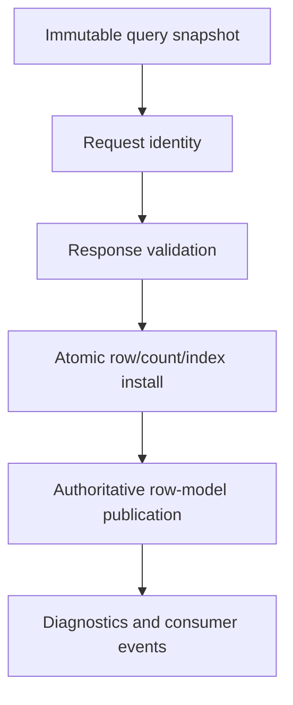
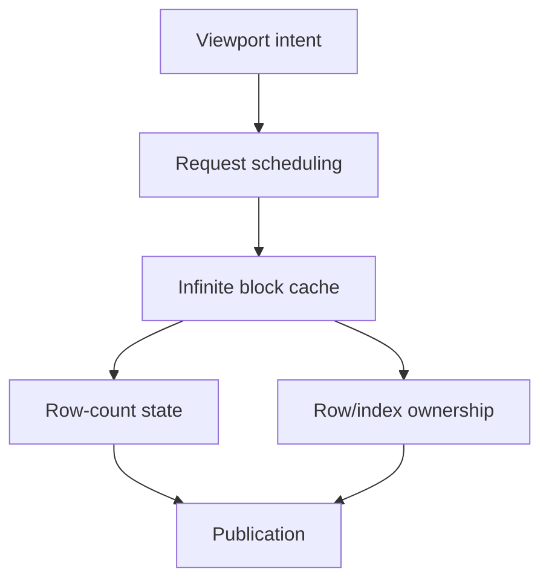
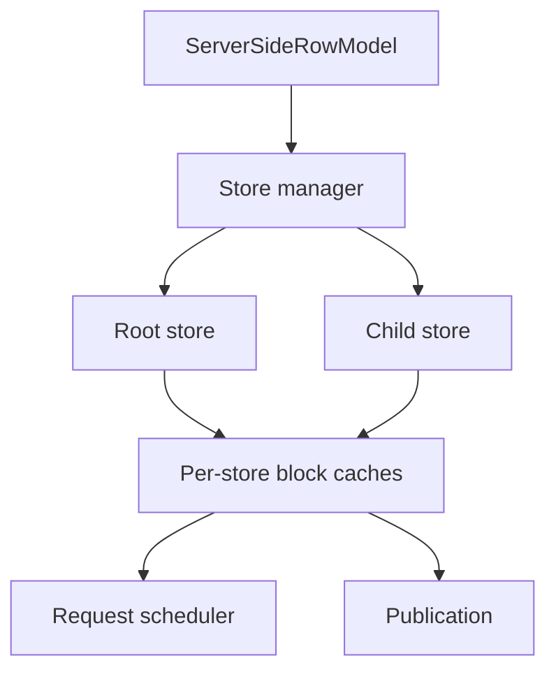

# Plan 158 Readiness Audit

Last audited: 2026-07-12

This document records the current evidence baseline for Plan 158. It is not a claim that Plan 158 is complete. It exists to satisfy the plan's required pre-implementation deliverables with repository-backed evidence so the remaining demolition and SSRM replacement work can proceed from an explicit shared understanding.

## Evidence sources

Primary evidence was taken from:

- `packages/core/src/infiniteRowModel.ts`
- `packages/core/src/serverPageRowModel.ts`
- `packages/core/src/serverRowModel.test.ts`
- `packages/core/src/serverRowModel.adversarial.test.ts`
- `packages/core/src/rowModel.capabilities.test.ts`
- `docs/architecture/plan-158-server-page-deletion-manifest.md`

## Exact failure analysis

### 1. Infinite block loading and blank-row publication

The core failure mode was never just "scroll rendering." The deeper issue was that async infinite responses could previously create or preserve invalid visual index ownership unless the response was:

- validated against the requested block range
- normalized to an explicit row-count state
- committed atomically into block ownership and index maps
- followed by one authoritative publication

Current evidence that this class of failure exists and is now explicitly protected:

- `packages/core/src/serverRowModel.test.ts`
  - non-zero block publication: `publishes a core refresh invalidation when a non-zero infinite block resolves`
  - blank-gap prevention: `rejects a short non-terminal infinite block response instead of committing blank gaps`
  - terminal short-block handling: `treats a short infinite block without totalCount as the terminal known row count`
  - oversized response rejection
  - duplicate row-id rejection
  - known-count shrink behavior
  - `hasMore` / `lastRow` terminal semantics
- `packages/core/src/infiniteRowModel.ts`
  - validates response shape before commit
  - computes terminal count before install
  - installs block rows into `blockCache`
  - rebuilds derived indexes
  - then publishes `publishBlockRefresh(...)`

Conclusion:

- The blank-row bug was a row-model authority bug, not a demo rendering bug.
- Infinite correctness depends on response validation plus atomic block/index/count publication.

### 2. Infinite sorting and filtering regression

The regression class was that query-owned async changes must not rely on incidental renderer work. Sort/filter changes must:

- snapshot query state once
- issue datasource work from that immutable snapshot
- reject stale responses
- publish the winning response through the row-model invalidation boundary

Current evidence:

- `packages/core/src/serverRowModel.test.ts`
  - `refetches infinite rows on sort changes and publishes the returned order`
  - `refetches infinite rows on filter changes and publishes the filtered result`
  - `refetches infinite rows on query-model changes and publishes the returned rows`
  - `passes an AbortSignal to the infinite datasource and aborts stale requests on query reset`
- `packages/core/src/serverRowModel.adversarial.test.ts`
  - stale responses and stale failures are ignored after sort/filter/datasource churn
- `packages/core/src/infiniteRowModel.ts`
  - request creation snapshots `sortModel`, `filterModel`, `quickFilterModel`, and `queryModel`
  - request-currentness is checked before commit
  - publication occurs only after block install

Conclusion:

- Infinite sort/filter behavior is core-owned and async-authoritative.
- Any remaining visible failure in demos would need to contradict the core publication/test evidence rather than replace it.

### 3. Current server sorting and filtering regression

The current `server` implementation is still a server-page controller. Its regression was twofold:

1. It is architecturally incompatible with the final SSRM target because it owns exactly one selected page.
2. It had specific correctness gaps where server-owned sort/filter fields could be locally edited without forcing a datasource refresh, leaving the loaded page inconsistent with the server-owned query contract.

Current evidence:

- `packages/core/src/serverPageRowModel.ts`
  - page responses clear and replace active rows atomically
  - publication occurs through `publishPageRefresh(...)`
  - page events and `serverPage` UI state are still first-class, proving this is not SSRM
  - `writeCellValueStructurally(...)` now reloads when an edited field participates in active sort or filter state
- `packages/core/src/serverRowModel.test.ts`
  - `refetches server-page rows on sort changes and publishes the returned order`
  - `refetches server-page rows on filter changes and publishes the filtered result`
  - `reloads the server-page datasource after editing a field that participates in server sort`
  - `reloads the server-page datasource after editing a field that participates in server filter`
  - page response validation and failure publication tests
- `docs/architecture/plan-158-server-page-deletion-manifest.md`
  - enumerates the still-live page-owned API, event, state, runtime, test, and React seams

Conclusion:

- Correctness patches can stabilize the current server-page model temporarily.
- They do not solve the architectural requirement that `rowModelType: 'server'` must become real SSRM and that the page model must be deleted.

## Shared infrastructure ownership diagram

## Infinite ownership diagram

## Real SSRM ownership target

## Public API before/after summary

| Area | Current evidence | Required Plan 158 end state |
| --- | --- | --- |
| Infinite datasource query | Core-owned and snapshot-based | Keep |
| Infinite async publication | Core-owned and tested | Keep and extend |
| `server` row model | Still page-oriented | Replace with real SSRM |
| `serverPage` UI state | Live | Delete |
| page navigation APIs/events | Live | Delete |
| server datasource contract | page-based | replace with route/block SSRM contract |

## Tests that would have failed against the pre-158 baseline

The following existing tests represent the major regression buckets that Plan 158 needed or still needs to protect:

- `publishes a core refresh invalidation when a non-zero infinite block resolves`
- `rejects a short non-terminal infinite block response instead of committing blank gaps`
- `refetches infinite rows on sort changes and publishes the returned order`
- `refetches infinite rows on filter changes and publishes the filtered result`
- `passes an AbortSignal to the infinite datasource and aborts stale requests on query reset`
- `reloads the server-page datasource after editing a field that participates in server sort`
- `reloads the server-page datasource after editing a field that participates in server filter`
- `publishes a core refresh invalidation when a server-page response resolves`
- `stale responses and stale failures are ignored after sort/filter/datasource churn`
- `stale responses and stale failures are ignored after page/sort/filter/query/datasource churn`

These tests should be treated as behavioral requirements during the remaining migration, even where the old server-page implementation itself is deleted.

## What remains unachieved

This audit does not prove Plan 158 complete. The largest remaining gaps are:

- `rowModelType: 'server'` still means server-page, not SSRM
- page-oriented public APIs, events, state, and React seams still exist
- the repository still exports and tests `ServerPageRowModelController`
- SSRM root/child store ownership does not exist yet
- the final server-side datasource contract does not exist yet
- demolition is not complete until repo search no longer finds live server-page implementation seams
