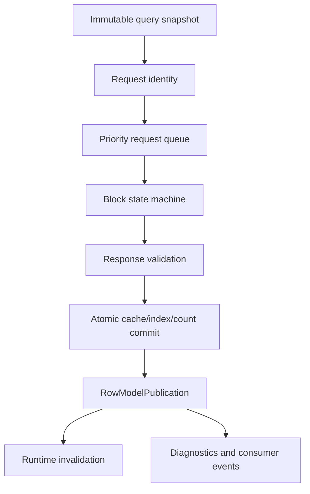
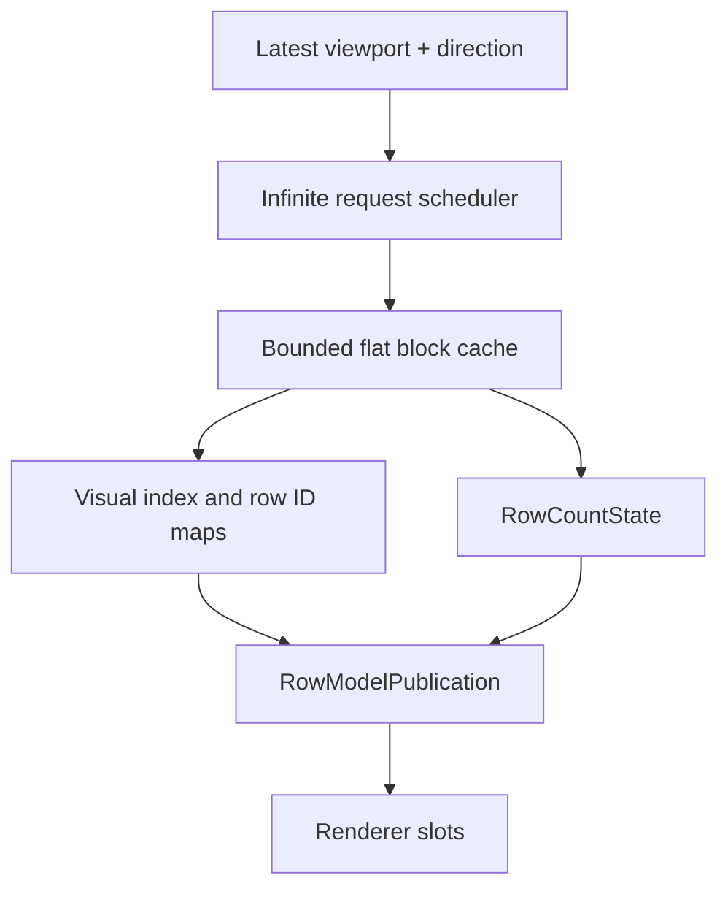
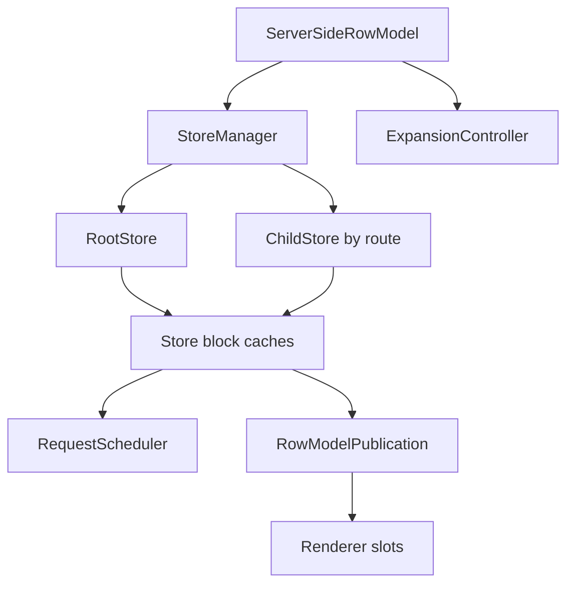

# Plan 158: Server-Backed Row Model Correctness + Real SSRM Replacement

> **Executor instructions**: Treat this as a P0 correctness and demolition plan, not a demo polish task. Sorting, filtering, loading, cache publication, and blank-row prevention must be fixed in `@open-grid/core`. Demos may be updated only after the core contract is correct and covered by tests.
>
> **Stop rule**: Do not start unrelated feature work. Do not add compatibility adapters around the current page-oriented `server` row model. Open Grid is alpha; breaking changes are acceptable and preferred when they remove incorrect architecture.
>
> **Drift check (run first)**: `git diff --stat HEAD -- packages/core/src packages/react/src demo-app src plans`
> If any in-scope row-model, renderer invalidation, runtime port, Grid API, datasource, or demo seam changed materially while this plan is in progress, reconcile this plan against the live code before implementation. Any mismatch in row-count authority, async publication, request identity, or server row-model ownership is a STOP condition until resolved.

## Status

- **Priority**: P0
- **Effort**: XXL
- **Risk**: CRITICAL
- **Depends on**: `plans/156-row-model-completion-and-public-row-node-facade.md`, `plans/157-interaction-kernel-hardening.md`
- **Category**: architecture, correctness, row models
- **Planned at**: working tree, 2026-07-12
- **Source directive**: shared guideline from the Plans 156/157 follow-up demolition brief

## Why this matters

Plans 156 and 157 completed enough row-model and interaction infrastructure to expose the next failure clearly: server-backed row models are not yet governed by one authoritative async publication contract. Infinite rows can intermittently disappear, scroll can skip records, and sort/filter changes are not reliably reflected for infinite and server row models.

The visible bug is blank rows. The deeper bug is architectural: async row-model responses can update internal caches without publishing one authoritative row-model transition to the runtime/renderer. Demo-level sorting/filtering cannot fix that. The fix belongs in core and must make server-backed row models deterministic under delayed, reordered, failed, stale, refreshed, filtered, and sorted network responses.

## North star

Final architecture must obey:

```txt
client:
  owns all rows locally
  sorts/filters/projects locally

infinite:
  owns one flat remote dataset
  loads bounded blocks by visual index
  sends sort/filter/query snapshots to datasource
  never publishes unexplained blank visual rows

server:
  owns a real hierarchical server-side row model
  root and child stores load blocks by route
  sends grouping/sort/filter/query snapshots to datasource
  contains no page-number/page-count semantics

async row-model response:
  validate response
  reject stale response
  build complete next internal state
  atomically install rows/nodes/indexes/counts/cache
  publish one row-model transition
  emit diagnostics and consumer events after publication

renderer:
  observes row-model publication and load-state transitions
  does not rely on incidental scroll, timers, diagnostics, or datasource events
```

## Current failures to prove first

- Infinite row model intermittently renders blank row bands while scrolling through loaded or expected rows.
- Infinite scrolling skips row indexes, especially around non-zero blocks and terminal-count transitions.
- Infinite sorting no longer visibly updates row order after datasource responses.
- Infinite filtering no longer reliably updates visible rows and row count after datasource responses.
- Current `server` row model sorting/filtering is page-oriented and may not publish correct core invalidations.
- Current `server` row model is not a real SSRM and must not survive as the final `rowModelType: 'server'` implementation.

## Non-negotiables

- Sorting/filtering behavior for infinite and server-backed models must be implemented in core, not in demos.
- Events such as block loaded, page loaded, or datasource response are observability events; they are not renderer invalidation.
- Request tokens are not a cache state machine.
- Loaded rows must not disappear during refresh unless the caller explicitly performs a hard purge.
- Invalid responses must never partially mutate row-model state.
- Stale responses must never mutate committed cache, indexes, counts, selection state, or visible rows.
- Unknown row count must be first-class and must not trap the model after block zero.
- Every represented visual index must have a deliberate state: loaded row, loading placeholder, failed placeholder, terminal gap outside known count, or intentionally absent outside model range.
- No unexplained `null`, empty, or blank visual rows are acceptable.
- `rowModelType: 'server'` must instantiate only the new SSRM after Stage C.
- The old page-style server row model must be deleted, not renamed, wrapped, preserved, or adapted.

## Out of scope

- Cosmetic demo redesigns.
- New grouping, pivot, aggregation UI, or unrelated enterprise features beyond the SSRM foundation required here.
- Backwards-compatible server-page aliases or migration shims.
- Timer-based repaint fixes, forced scroll nudges, or renderer hacks that mask row-model publication bugs.

## Required pre-implementation deliverables

Complete these before changing production code:

- [ ] Exact failure analysis for infinite block loading and blank-row publication.
- [ ] Exact failure analysis for infinite sorting and filtering.
- [ ] Exact failure analysis for current server sorting/filtering regression.
- [ ] Deletion manifest for the current page-oriented server row model.
- [ ] Shared server-backed infrastructure ownership diagram.
- [ ] Infinite row model ownership diagram.
- [ ] Real SSRM ownership diagram.
- [ ] Public API before/after table.
- [ ] Tests expected to fail before implementation.

## Stage A - Repair the shared async row-model contract

Do this before hardening infinite or replacing server. The shared contract must be reusable by infinite and SSRM without merging their controllers.

### A1 - Failure reproduction tests

Add failing tests that prove the regressions before fixing them:

- [ ] Infinite sorting sends the active sort model to the datasource and publishes the sorted response into visible rows.
- [ ] Infinite filtering sends the active filter model to the datasource and publishes the filtered response and row count.
- [ ] Current server sorting/filtering failure is captured as a regression test before demolition.
- [ ] Non-zero infinite block publication invalidates the renderer without incidental scroll.
- [ ] Stale query responses are rejected after sort/filter/query generation changes.
- [ ] Row-count transitions publish geometry changes for `unknown`, `estimated`, and `known` counts.
- [ ] Async block response publication updates runtime projection and renderer-visible slots in the same authoritative transition.

### A2 - Shared request identity

Introduce immutable request identity that every server-backed request carries:

```ts
interface AsyncRowModelRequestIdentity {
  datasourceGeneration: number;
  queryGeneration: number;
  requestId: number;
  scopeId: string;
}
```

- [ ] `datasourceGeneration` changes when datasource identity changes.
- [ ] `queryGeneration` changes when sort/filter/quick-filter/query model changes.
- [ ] `requestId` is unique within the controller.
- [ ] `scopeId` identifies the infinite model, root SSRM store, or child SSRM store.
- [ ] Stale identity rejection happens before validation or mutation.

### A3 - Immutable query snapshots

Capture query state once at request creation:

```ts
interface AsyncRowModelQuerySnapshot {
  sortModel: SortModel | null;
  filterModel: FilterModel | null;
  quickFilterModel: QuickFilterModel | null;
  queryModel: QueryModel | null;
}
```

SSRM snapshots additionally include route, group keys, row-group columns, value columns, pivot/grouping metadata, and block range. No datasource request may read mutable live grid state after scheduling.

### A4 - Authoritative row-model publication

Add one explicit core operation for async row-model publication:

```ts
interface RowModelPublication {
  reason:
    | 'datasourceChanged'
    | 'queryChanged'
    | 'viewportChanged'
    | 'blockQueued'
    | 'blockLoaded'
    | 'blockFailed'
    | 'blockEvicted'
    | 'rowCountChanged'
    | 'refreshStarted'
    | 'refreshCompleted'
    | 'purgeCompleted';
  scopeId: string;
  affectedRange: { startRow: number; endRow: number } | null;
  previousRowCount: RowCountState;
  nextRowCount: RowCountState;
  structureChanged: boolean;
  orderChanged: boolean;
  geometryChanged: boolean;
  availabilityChanged: boolean;
  loadStateChanged: boolean;
  changedRowIds: readonly string[];
}
```

- [ ] Infinite and SSRM publish through the same runtime operation.
- [ ] Publication is emitted after complete internal state install, not during partial mutation.
- [ ] Runtime invalidation is derived from the publication, not from diagnostics.
- [ ] Consumer events are emitted after publication.
- [ ] Renderer tests prove publication alone is sufficient to repaint newly available rows.

### A5 - Shared primitives

Build shared infrastructure that can be reused by infinite and SSRM without collapsing them into one controller:

- [ ] Request identity and stale rejection.
- [ ] Immutable query snapshots.
- [ ] Request queue with priority, concurrency, cancellation, and deterministic draining.
- [ ] Block state machine primitives.
- [ ] Row-count state and normalization.
- [ ] Response validation helpers.
- [ ] Cache eviction policy hooks.
- [ ] Async publication bridge.
- [ ] Diagnostic snapshot helpers.

## Stage B - Finish infinite as a production flat block model

Infinite is one flat remotely loaded dataset backed by a bounded block cache. It is not hierarchical and not page-based.

### B1 - Datasource contract

Replace any ambiguous or demo-owned query behavior with a core-owned datasource contract:

```ts
interface InfiniteGetRowsRequest {
  startRow: number;
  endRow: number;
  sortModel: SortModel | null;
  filterModel: FilterModel | null;
  quickFilterModel: QuickFilterModel | null;
  queryModel: QueryModel | null;
}

interface InfiniteGetRowsResult<TRow> {
  rows: readonly TRow[];
  rowCount?: number;
  lastRow?: number;
  hasMore?: boolean;
}

interface InfiniteDatasource<TRow> {
  getRows(
    request: InfiniteGetRowsRequest,
    context: { signal?: AbortSignal },
  ): Promise<InfiniteGetRowsResult<TRow>>;
}
```

### B2 - Block state machine

Each block must have an explicit state:

- [ ] `absent`
- [ ] `queued`
- [ ] `loadingInitial`
- [ ] `loaded`
- [ ] `refreshing`
- [ ] `failedInitial`
- [ ] `failedRefresh`
- [ ] `stale`

Required semantics:

- [ ] Separate committed block data from active request state.
- [ ] Refresh retains committed rows.
- [ ] Failed refresh retains committed rows.
- [ ] Hard purge removes committed rows and exposes loading placeholders.
- [ ] Stale responses mutate nothing.
- [ ] No block can remain permanently loading after success, failure, abort, datasource replacement, or query generation change.

### B3 - Row-count authority

Use an explicit row-count state:

```ts
type RowCountState =
  | { kind: 'unknown' }
  | { kind: 'estimated'; count: number }
  | { kind: 'known'; count: number };
```

Rules:

- [ ] Full block with no terminal signal means more rows may exist.
- [ ] Unknown count must expose enough provisional tail for the next block to be requested.
- [ ] Short block without contradiction establishes final known count.
- [ ] Explicit `rowCount` or terminal `lastRow` establishes known count.
- [ ] `hasMore: false` establishes a terminal count from the response range.
- [ ] Known count never exposes visual rows beyond terminal.
- [ ] Known shrinking count purges or hides rows beyond the new terminal.
- [ ] Unknown count must not be trapped after block zero.

### B4 - Viewport and request scheduling

Replace pending viewport range union behavior with authoritative viewport scheduling:

- [ ] Track latest viewport range and scroll direction.
- [ ] Prioritize blocks intersecting the visible range.
- [ ] Prefetch a small configurable adjacent range.
- [ ] Discard or delay distant queued work after rapid scrolling.
- [ ] Coalesce duplicate block requests.
- [ ] Respect max concurrency.
- [ ] Support explicit retry.
- [ ] Abort stale or distant requests when supported by datasource.
- [ ] Drain queue deterministically.

### B5 - Bounded cache and indexes

The cache must be bounded and index ownership must be explicit:

- [ ] Support `maxBlocksInCache`.
- [ ] Use LRU or an equivalent deterministic policy.
- [ ] Never evict visible blocks.
- [ ] Eviction removes node/index ownership.
- [ ] Reload after eviction is deterministic.
- [ ] Maintain row ID -> node.
- [ ] Maintain visual index -> row ID.
- [ ] Maintain row ID -> visual index.
- [ ] Maintain block -> owned row IDs.
- [ ] Maintain row ID -> owning block.
- [ ] Replace quadratic full-index rebuilds with known-position updates.
- [ ] Detect row ID duplication within a block.
- [ ] Detect row ID ownership across multiple active visual indexes.

### B6 - Response validation

Validate every response before commit:

- [ ] No negative row count.
- [ ] No impossible terminal count.
- [ ] No oversized response.
- [ ] No duplicate row IDs within a response block.
- [ ] No row ID assigned to conflicting active visual positions.
- [ ] Empty responses are deterministic and terminal only when terminal signals require it.
- [ ] Short responses normalize terminal count consistently.
- [ ] Invalid responses fail the request and do not partially commit.

### B7 - Loading and diagnostics

Separate loading concepts:

- [ ] `initialModelLoading`
- [ ] `visibleRangeLoading`
- [ ] `backgroundPrefetching`
- [ ] `refreshing`
- [ ] `visibleRangeFailed`

Add diagnostic snapshots:

```ts
interface InfiniteBlockSnapshot {
  blockId: string;
  startRow: number;
  endRow: number;
  state: string;
  requestId: number | null;
  rowCount: number;
  committedRowIds: readonly string[];
  lastAccessedAt: number;
}
```

### B8 - Infinite adversarial tests

Required tests:

- [ ] Rapid distant scrolling does not leave unexplained blanks.
- [ ] Rapid distant scrolling prioritizes visible blocks.
- [ ] Concurrency never exceeds configured max.
- [ ] Refresh retains committed rows.
- [ ] Failed refresh retains committed rows.
- [ ] Hard purge removes committed rows and exposes loading placeholders.
- [ ] Unknown count can request beyond block zero.
- [ ] Short terminal response establishes known count.
- [ ] Known count shrink removes out-of-range rows.
- [ ] Oversized response is rejected without partial commit.
- [ ] Duplicate row IDs are rejected.
- [ ] Stale response is rejected.
- [ ] Failed initial request exposes failed placeholders.
- [ ] Retry recovers failed initial request.
- [ ] Eviction removes indexes and reloads deterministically.
- [ ] No block is permanently loading.
- [ ] Every represented row index has a deliberate state.
- [ ] No unexplained `null` or blank row is returned for an in-range visual index.
- [ ] Sorting and filtering update visible rows through row-model publication without incidental renderer refresh.

## Stage C - Delete server-page and build real SSRM

Do not begin Stage C until Stage A and Stage B pass correctness tests. Stage C must be atomic: old page server code is removed in the same change set that introduces real SSRM.

### C1 - Deletion manifest

Delete or replace all page-oriented server row-model concepts:

- [ ] `ServerPageRowModelController`.
- [ ] Server page cache/state abstractions.
- [ ] Explicit page navigation owned by server row model.
- [ ] Server page, page size, page count state.
- [ ] Page-specific datasource contracts.
- [ ] Page-specific runtime events.
- [ ] Page-specific selectors.
- [ ] Page-specific public APIs.
- [ ] Page-specific demos.
- [ ] Page-specific tests.
- [ ] Page-specific docs.
- [ ] Compatibility aliases that preserve page behavior.
- [ ] Any assumption that `rowModelType: 'server'` means selected-page fetch.

Removed public API examples:

- [ ] `getCurrentServerPage`
- [ ] `setCurrentServerPage`
- [ ] `goToServerPage`
- [ ] `getServerPageCount`
- [ ] `nextServerPage`
- [ ] `previousServerPage`
- [ ] `serverPageChanged`
- [ ] `serverPageLoaded`
- [ ] `serverPageSize`
- [ ] `pageNumber` in datasource requests

### C2 - SSRM ownership model

Target layers:

```txt
ServerSideRowModel
  -> StoreManager
     -> RootStore
     -> ChildStore(route)
        -> BlockCache
           -> Block
  -> RequestScheduler
  -> ExpansionController
  -> Async row-model publication bridge
```

Responsibilities:

- [ ] `ServerSideRowModel` owns public row-model integration and high-level operations.
- [ ] `StoreManager` owns store lifecycle, route lookup, and recursive destroy.
- [ ] `RootStore` owns top-level flat/group rows.
- [ ] `ChildStore` owns lazy group children by canonical route.
- [ ] `BlockCache` owns bounded block data per store.
- [ ] `Block` owns state machine and committed rows.
- [ ] `RequestScheduler` owns priority/concurrency/cancellation.
- [ ] `ExpansionController` owns group expansion and child store creation.

### C3 - SSRM datasource contract

Introduce the real SSRM datasource contract:

```ts
interface ServerSideGetRowsRequest {
  startRow: number;
  endRow: number;
  route: readonly string[];
  groupKeys: readonly string[];
  rowGroupColumns: readonly ServerSideRowGroupColumn[];
  valueColumns: readonly ServerSideValueColumn[];
  sortModel: SortModel | null;
  filterModel: FilterModel | null;
  quickFilterModel: QuickFilterModel | null;
  queryModel: QueryModel | null;
}

interface ServerSideGetRowsResult<TRow> {
  rows: readonly TRow[];
  rowCount?: number;
  lastRow?: number;
  hasMore?: boolean;
  aggregateData?: Readonly<Record<string, unknown>>;
  groupMetadata?: readonly ServerSideGroupMetadata[];
}

interface ServerSideDatasource<TRow> {
  getRows(
    request: ServerSideGetRowsRequest,
    context: { signal?: AbortSignal },
  ): Promise<ServerSideGetRowsResult<TRow>>;
}
```

Do not include page number, page count, selected page, or page-owned row-index semantics.

### C4 - SSRM public API after replacement

Public API should converge to:

```ts
rowModelType: 'server'

serverSide: {
  datasource: ServerSideDatasource<TRow>;
  blockSize?: number;
  maxBlocksInCache?: number;
  maxConcurrentRequests?: number;
  prefetchBlockCount?: number;
}

api.setServerSideDatasource(datasource)
api.refreshServerSide(options)
api.purgeServerSide(options)
api.getServerSideStoreState()
```

No compatibility overloads for page APIs.

### C5 - SSRM minimum feature set

- [ ] Flat root loading.
- [ ] Virtual scrolling.
- [ ] Bounded block cache.
- [ ] Max concurrency.
- [ ] Viewport-priority loading.
- [ ] Server-side sort model propagation.
- [ ] Server-side filter model propagation.
- [ ] Server-side quick filter propagation.
- [ ] Server-side query model propagation.
- [ ] Refresh without purge.
- [ ] Hard purge.
- [ ] Stale response rejection.
- [ ] Unknown, estimated, and known row counts.
- [ ] Stable loaded `RowNode` identity.
- [ ] Route-aware requests.
- [ ] Lazy child stores.
- [ ] Child store loading states.
- [ ] Recursive store destroy.
- [ ] Partial store refresh.
- [ ] Store-level failure states.
- [ ] Group row child-store creation.
- [ ] Scoped cache eviction.
- [ ] Aggregate metadata capture.
- [ ] Store/block diagnostics.
- [ ] Truthful capabilities for unsupported operations.

### C6 - SSRM node and route identity

- [ ] Routes are immutable and canonical.
- [ ] Route equality does not depend on object reference.
- [ ] Group identity is explicit.
- [ ] Loaded nodes are retained or destroyed deterministically.
- [ ] Illegal row ID reuse across incompatible routes is detected.
- [ ] Selection of loaded rows is honest.
- [ ] Stable selected IDs across eviction are supported only when explicitly configured.
- [ ] Range selection is limited to loaded visible rows.
- [ ] No fake select-all-server-rows behavior.

### C7 - SSRM refresh and purge

Add explicit operations:

```ts
api.refreshServerSide({ route?: readonly string[]; purge?: false })
api.purgeServerSide({ route?: readonly string[] })
```

Semantics:

- [ ] Refresh without purge retains committed rows while refreshing.
- [ ] Failed refresh retains committed rows.
- [ ] Purge removes committed rows for the target route and exposes loading state.
- [ ] Query changes create explicit refresh plans.
- [ ] No page reset semantics exist.

### C8 - SSRM tests

Required coverage:

- [ ] `rowModelType: 'server'` constructs only SSRM.
- [ ] Flat root block loads and publishes visible rows.
- [ ] Non-zero root block publication repaints without scroll.
- [ ] Server sort model reaches datasource and updates visible rows.
- [ ] Server filter model reaches datasource and updates visible rows/count.
- [ ] Quick filter/query model reaches datasource.
- [ ] Stale root response is rejected.
- [ ] Stale child-store response is rejected.
- [ ] Root unknown count can load beyond block zero.
- [ ] Short root response establishes terminal count.
- [ ] Root known count shrink removes out-of-range rows.
- [ ] Root failed initial load exposes failed state.
- [ ] Root retry recovers.
- [ ] Refresh retains committed rows.
- [ ] Failed refresh retains committed rows.
- [ ] Purge removes committed rows.
- [ ] Cache eviction does not evict visible root blocks.
- [ ] Evicted root blocks reload deterministically.
- [ ] Group row expands and creates child store.
- [ ] Child store request includes canonical route and group keys.
- [ ] Child store sort/filter/query snapshot is immutable.
- [ ] Collapsing group destroys or detaches child store deterministically.
- [ ] Recursive destroy aborts in-flight child requests.
- [ ] Child store unknown count can load beyond first block.
- [ ] Child store terminal count is respected.
- [ ] Store-level diagnostics report states.
- [ ] Block-level diagnostics report states.
- [ ] Duplicate row ID in one store is rejected.
- [ ] Illegal row ID reuse across incompatible routes is rejected.
- [ ] Aggregate metadata is captured.
- [ ] Loaded row selection survives refresh.
- [ ] Eviction selection behavior matches configured capability.
- [ ] Range selection only covers loaded visible rows.
- [ ] Unsupported select-all-server behavior is reported honestly.
- [ ] Old server page APIs are absent from public types.
- [ ] Repo search finds no old server-page symbols.
- [ ] Page-oriented demos/docs/tests are deleted or rewritten for SSRM.

## Ownership diagrams

### Shared server-backed infrastructure



### Infinite row model



### Real SSRM



## Public API before/after table

| Area | Before | After |
| --- | --- | --- |
| Infinite sort/filter | May be demo-owned or not authoritatively published | Core sends immutable query snapshots and publishes row-model transitions |
| Infinite row count | Implicit/fragile terminal inference | Explicit `RowCountState` with unknown/estimated/known |
| Infinite blank rows | Possible unexplained `null`/blank slots | Every visual index has a deliberate loaded/loading/failed/terminal state |
| Server model | Page-oriented `rowModelType: 'server'` | Real SSRM under `rowModelType: 'server'` |
| Server datasource | Page request/page response concepts | Route/block request with sort/filter/query/group metadata |
| Server page APIs | `getCurrentServerPage`, `goToServerPage`, page events | Removed |
| Server refresh | Page reset/refetch semantics | `refreshServerSide` and `purgeServerSide` |
| Renderer invalidation | May rely on events/incidental updates | Driven by `RowModelPublication` |

## Verification gates

### After Stage A and B

- [ ] Run all core tests.
- [ ] Run React tests.
- [ ] Run typecheck.
- [ ] Run build.
- [ ] Run renderer adversarial tests.
- [ ] Report request counts during rapid scrolling.
- [ ] Report observed max concurrency.
- [ ] Prove no represented infinite index returns unexplained `null`.
- [ ] Prove infinite sorting/filtering works through core publication, not demo state.

### After Stage C

- [ ] Run full repo tests.
- [ ] Run SSRM hierarchy tests.
- [ ] Run stale/reordered/failed response tests for root and child stores.
- [ ] Search repo for old server-page symbols.
- [ ] Prove `rowModelType: 'server'` creates only SSRM.
- [ ] Report removed APIs.
- [ ] Report changed datasource types.
- [ ] Report unsupported capabilities honestly exposed by SSRM.
- [ ] Prove no page implementation survives.

## Completion definition

This plan is complete only when all of the following are true:

- [ ] `client` remains the local all-rows model.
- [ ] `infinite` is a production flat remote block model.
- [ ] `server` is a real hierarchical server-side row model.
- [ ] There is zero legacy server-page implementation.
- [ ] There are zero compatibility aliases for old server-page APIs.
- [ ] Infinite has zero unexplained blank rows under adversarial scrolling.
- [ ] Infinite sort/filter is deterministic under delayed, reordered, failed, and stale responses.
- [ ] SSRM sort/filter is deterministic under delayed, reordered, failed, and stale responses.
- [ ] Async row-model publication is the only renderer invalidation path for committed async row changes.
- [ ] Demos exercise the core behavior but do not own it.
